# 数据库索引
## 1 生活中的索引
  生活中很多地方都使用到索引的概念，最经典的就是小时候查字典，上千页的字典，怎么快速的找到多们想要找的那个字呢？ 字典一般都会有偏旁部首或者是拼音开始查询；还有就是图书馆找对应的书籍。我们生活中的这些索引和数据库的索引在本质上是一样的。

我再列举一个具体的例子：  
比如说在一个学校里，我们想找出个子“最高的10个”同学，或者想查找姓名是“张三”的同学，又或者是查找学号是“007”的同学等等，在这些场景中，我们来分别罗列一下一些可行的方案。

### 1.1  找出个子“最高的10个”同学

- 如果全校学生数量不多的话，把全校的同学都拉到操场由矮到高依次排队，排在最后的10个同学自然就是个子最高的。
- 在各个班级内部排队比较，找出本班级内个子最高的10个同学，然后把每个班级选出来的10个人拉到操作去排队，排在最后的10个同学是个子最高的。
- 先随机找10个同学作为标杆，让全校的同学依次来跟这10个同学比较一下身高，比10个同学中的任何一个都矮就不管，比任何一个高的就留下来，同时让原来10个同学中最矮的同学离开，经过一轮对比，最后留下来的10个同学是个子最高的。

### 1.2 查找姓名是“张三”的同学

- 由于存在相同姓名的同学，所以可以依次把全校的同学都问一遍：“你是不是叫张三？”，然后把回答“是”的人都记录下来。
-  假设事先能打听到那些班级里有叫“张三”的同学，然后直接去这些班级里依次问一下。

### 1.3 查找学号是“666”的同学

- 由于学号是全校唯一的，可以直接找到这个同学。

上面举例了几个生活中的关于查找的场景，可以发现对于不同需求不同场景，我们是可以选择不同的方案来达到目的，只不过不同的方案在效率上会有所不同。比如如果学校有上万的学生，全部拉到操场依次排队的方案就比较耗时，又比如事先能知道某些前提条件（比如知道那些班级有姓名是“张三”的同学），就可以加快查找的过程。

## 2.  MySQL的索引

我们把思维转换一下，如果把上述生活中的场景映射到MySQL数据库会是怎么样的呢？不同的场景下，MySQL会如何来查找数据呢？我们都知道MySQL的一些概念，比如全表扫描、索引等，也知道利用索引可以加快查找数据的过程，不过具体到MySQL内部，全表扫描具体是怎么一回事呢？索引的结构是怎么样的呢？按索引查找数据具体又是如何工作的呢？

为了更好的进行说明，假设我们现在有一个学生表，然后有学号ID（主键）、姓名name两个字段，除主键ID外，还给姓名字段创建了一个普通索引，建表语句如下：

```mysql
CREATE TABLE `student` ( 
 `ID` bigint(20) NOT NULL AUTO_INCREMENT COMMENT '主键ID、学号',  
 `name` varchar(32) NOT NULL COMMENT '姓名',  
 PRIMARY KEY (`ID`) USING BTREE, 
  KEY `idx_name` (`name`) USING BTREE
) ENGINE=InnoDB AUTO_INCREMENT=2 DEFAULT CHARSET=utf8mb4;        
```

（备注：使用mysql innodb存储引擎）

相信大家都看得懂上面的SQL语句的，然后我们也直接用主键ID表示学号。接下来往这个表里插入了1千条记录（表示学校有1000个学生），主键ID（学号）的值就是从1到1000，然后姓名name依次是name1到name1000，插入语句如下：
```mysql
INSERT INTO student (id, `name`) VALUES  
(1, 'name1'), 
(2, 'name2'), 
(3, 'name3'), 
...  
(999, 'name999'), 
(1000, 'name1000');             
```
接下来，分别看一下根据主键ID查找数据的方式与根据姓名name查找数据的方式。

### 2.1 根据主键ID查找数据

MySQL作为一个关系型数据库，最核心也是最基本的一个功能就是存储数据，而数据的存储最终都是存储在磁盘文件上的，不过MySQL并不会像Java中那样把一个对象序列化之后直接存储到磁盘上去，因为这样的话后续就不太方便来查找数据了，所以MySQL在一行数据的存储上做了一定的设计。我们平时是以记录为单位来向表中插入数据的，我们在Navicat等客户端看到是一个表格，里面有一行一行的记录，比如下面这样：

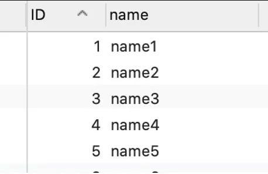

但这些记录最终在磁盘上的存放方式是有规则的，一个记录在磁盘上的存放方式也被称为行格式，行格式的简单的示意图如下：


（PS：当我们深入理解MVVC事务原理时，就更知道隐藏字段的作用了）

重点关注一下上图红色部分的记录头信息，它里面会有个next_record指针，用于指向下一条记录。像下图这样：

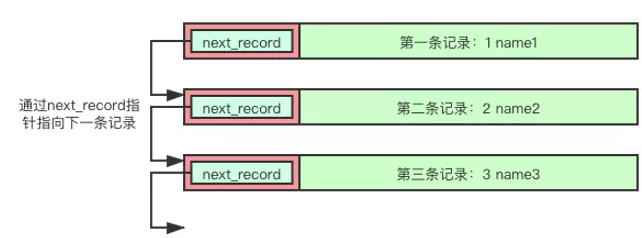

所以最终我们插入到表的记录其实就是这样一行一行的存储到了磁盘的数据文件中，然后用这个next_record指针彼此关联了起来。
不过大部分情况下一个表中可能有成千上万的记录，所以MySQL为了更方便管理这些记录，规定用**数据页**为基本单位来存放记录。一个数据页的容量大小是固定的，默认大小**16KB**，所以一个数据页中能存放多少条记录是由这些记录的大小来决定的，记录本身占用的空间小就能多存一些记录。假设一条记录大小是30个字节的话，那么一个数据页大概能存储16*1024/30 ≈ 500多条记录。但为了更直观的理解，我们现在约定一个数据页就只能存放10条记录好了。

当一个数据页存满了记录之后，MySQL就开辟一个新的页继续存储，这个过程也就是就是MySQL中的**页分裂**，新开辟出来的数据页会跟原来的数据页之间有个双向链表的互相关联着，像下图这样：

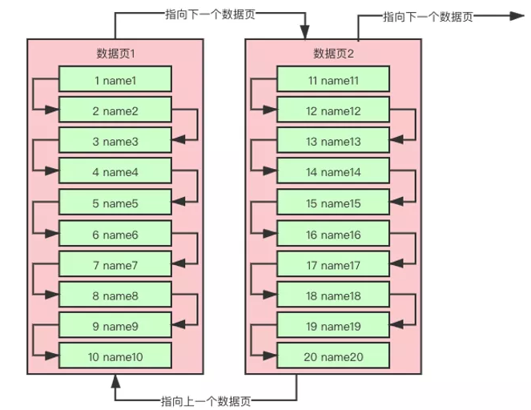

好了，现在我们知道了记录是存在数据页中的，数据页内的记录之间有个单向链表指向下一条记录，然后数据页之间有个双向链表互相关联，那么这个时候我就可以来思考一下MySQL中按主键ID来查找数据是怎么找的了。

比如我们要查找ID=12这条记录，MySQL首先去到数据页1中从第一条记录开始查找，如果第一条记录不匹配，就沿着单向链表查找下一条记录，以此类推会一次把数据页1中的所有记录都查找出来对比一下。如果数据页1中没有找到目标记录，那么就沿着数据页1与数据页2之间的双向链表从数据页2的第一条记录继续查找，如果找到了目标数据就返回给客户端，没找到的话就沿着单向链表把数据页2中的记录都遍历一遍。如果数据页2中的记录也都遍历完了，会看下数据页2还有没有关联下一个数据页3，有的话继续查找，没有就返回空给客户端。

看着上面的操作过程，不知道大家有没有感觉出来，这个过程其实就是数据库中的**全表扫描**。利用数据页内部记录之间的单向链表与数据页之间的双向链表依次把表中每条记录都遍历一下，这个过程就是全表扫描。

我们知道链表的时间复杂度是O(n)，而数组的时间复杂度是O(1)，所以如果一个数据页中的记录比较多的时候，利用记录间的单向链表查找数据还是会比较慢的，所以MySQL在数据页内部还搞了一个**页目录**的概念。

页目录大概的思想就是把数据页内部的记录划分为若干个组，每个组有少量的记录。然后多个组的信息都放到数据页的页目录中去组成一个数组，这样做之后，每次根据主键ID来查找数据的时候，先在页目录中利用二分查找定位到目标记录在那个组里面，然后就直接去这个组里面依次遍历里面的记录。这样就可以比直接把数据页中的所有记录都遍历一遍性能提高了，数据页的页目录如下图这样：

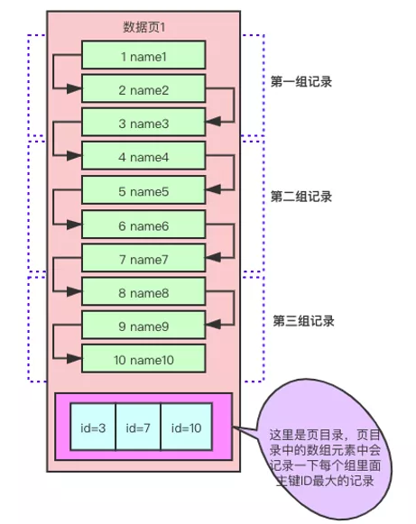

一个数据页内根据主键ID查找记录，现在我们知道了是利用了记录间的单向链表一路遍历下去查找的，然后为了加快数据页内记录查找速度，又搞了一个页目录出来。
然后就是第一个数据页中没有找到目标记录，会利用数据页之间的双向链表找到下一个数据页，然后按照在第一个数据页内一样的查找方式去查找目标记录。
如果一个表的记录很多，导致数据页很多呢？比如前面假设一个数据页存储10条记录，那么存储1000个学生记录，就需要100个数据页。这么多个数据页之间只能利用数据页之间的双向链表的依次遍历下去的话，性能还是比较慢的，比如我们要查询ID=1000的那个学生记录，就得需要把总共的1000条记录都遍历一下。MySQL为了在多个数据页的情况下提高查询性能，这个时候索引就登场了。

### 2.2 索引

MySQL中的索引是一个**B+**树结构，然后分为**聚族索引跟非聚族索引**两种

引用： [B树与B+树.md](..\..\DataStructure\BTreeAndB+Tree.md) 

#### 2.2.1 聚族索引

我们先说聚族索引吧。聚族索引其实就是基于主键ID创建的B+树结构，聚族索引的叶子节点其实就是普通的数据页，这些普通的数据页里面记录了完整的用户记录信息，然后非叶子节点也是一个个16KB大小的数据页，为了与普通的数据页区分，我们就叫它为索引页。索引页里面存放的不是完整的用户信息，而是只存放它关联的各个下级数据页中的最小记录的主键ID值以及所在的数据页页号。
这么说可能比较抽象，我们把存放了1000条学生信息的聚族索引结构画出来看一下：

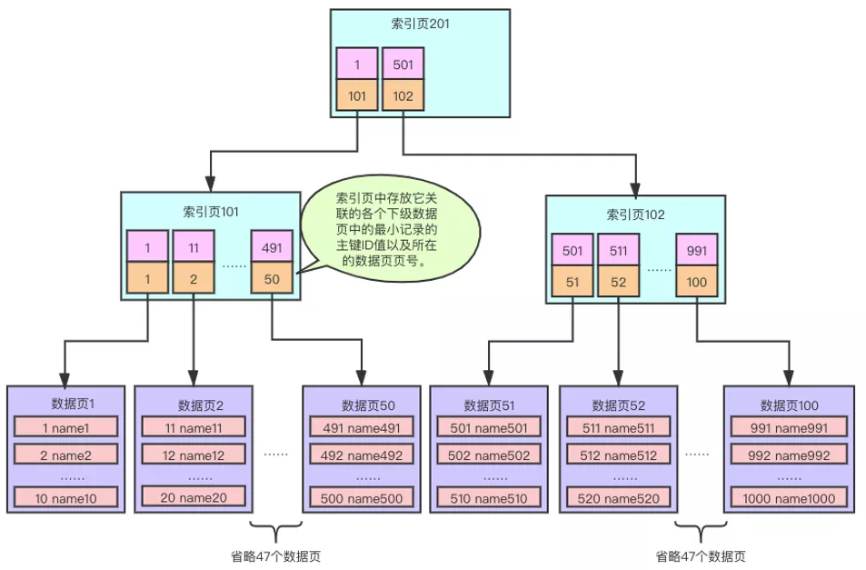

上面的图，我们是约定一个普通数据页最多放10条记录，一个索引页最多放50条记录。由于总共有1000条学生记录，那么普通数据页总共是100个，然后第二层的索引页每页可以放50条记录，就有2个索引页，最顶层的索引里面只有2条记录分别关联着第二层的两个索引页。

对着上面的图，我们再来看下如果要查找ID=1000的这个学生记录，要怎么来查找呢？首先在最顶层的索引页201中判断，1000大于501，说明目标记录在ID=501关联的下级索引页中，也就是索引页102，接着到索引102中来判断，1000大于991，说明目标记录在ID=991关联的下级数据页中，也就是数据页100，最后到数据页100中去查找，利用前面说的数据页内部记录之间的单向链表与页目录，就可以快速的找到目标记录了，像下图这样：

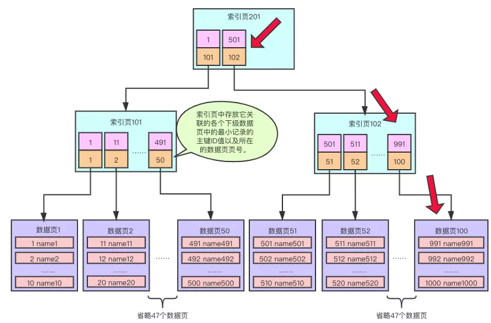

可以明显的看到，有了索引之后，我们查找到ID=1000的记录，就只需要在2个索引页中判断，最后在一个数据页中进行快速的比对就可以了，完全不用从第一个数据页的第一条记录开始依次遍历下来进行查找，其实这个就是利用索引B+树结构来提高查询速度的原理，比全表扫描的性能高太多了。

到这里基本上就把MySQL里面根据主键ID查找数据的基本原理都介绍清楚了，包括数据页内部记录间的单向链表，数据页内部为了提高查找数据的页目录，数据页与数据页之间的双向链表，以及最后介绍的聚族索引B+树结构。

不过还有些细节还是要补充一下的：

• 无论是普通数据页还是索引页中的记录一定是会按照主键ID的大小从到大排列存储的，新插入的记录不满足这个规则的时候，MySQL自己会进行相应记录的移动处理。
• 后一个数据页中的最小记录的主键ID值一定是比上一个数据页中的最大记录的主键ID大的，如果不满足这个规则的时候，MySQL自己也会进行相应记录的移动操作。
• MySQL规定每个表都必须存在主键列的，如果我们自己没有设置主键，MySQL内部会创建一个隐藏的列来作为主键。
• 索引页其实跟普通的数据页是一样的也是16KB的大小，然后索引页中的记录存放方式跟数据页中存放用户记录的方式与规则也是一样的。
• 普通索引页中存放完整的用户记录，也就是会存储表中所有列的值，而索引页中的记录就只存放下级每个数据页中的最小记录的ID值与页号这两个列的值。
• 索引页中的记录之间也是维护着一个单向链表的，而且索引页内部也有一个页目录结构，跟普通数据页中是一样的。
• 同一层级的索引页与索引页之间也是维护一个双向链表的。

#### 2.2.2 非聚族索引

前面已经介绍清楚了根据主键ID在聚族索引中是如何查找数据的，接下来介绍一下给普通的列建立索引，然后根据这个列的值作为查询条件的时候是如何来找数据的。

首先看一下在一个数据页内部，如果要根据姓名name来查找数据要怎么做，比如查询name=name12这条记录，我们再来看一下存放了学生记录的数据页示意图：

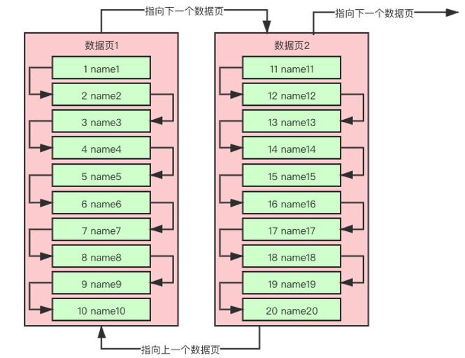

由于name=name12这条记录在数据页2中，所以一开始从数据页1的第一条记录开始找起，沿着单向链表把数据页1中的记录都遍历一遍，没有找到目标记录，继续沿着数据页之间的双向链表找到数据页2，从数据页2中的第一条记录开始，重复在数据页1中的查找操作，最后匹配到了name=name12这个目标记录。

特别说明的是，如果不是按照主键ID来查找数据，在数据页内部查找数据的时候，数据页中的页目录是用不上的，只能利用记录间的单向链表依次遍历下去进行查找。

跟按照主键ID来查找数据的时候遇到一样的问题，如果一个表中的记录数越来越多的时候，数据页也就会越来越多，比如前面的例子中1000个学生记录，总共是100个数据页。MySQL为了在多个数据页的情况下提高根据普通列值作为条件时的查询性能，会创建一个非聚族索引B+树结构出来（当然前提是我们给这个普通的列创建了索引）。

非聚族索引跟聚族索引的结构是很相似的，但也是有区别的，最大的区别就是非聚族索引的叶子节点中存储仅仅是创建了索引这个列的值与这个这个值所在记录的主键ID值，其次是非叶子节点中存放的是下级索引页中最小记录的列值与下级索引页的页号。

我们也把1000条学生记录name列的非聚族索引B+树结构画一下：

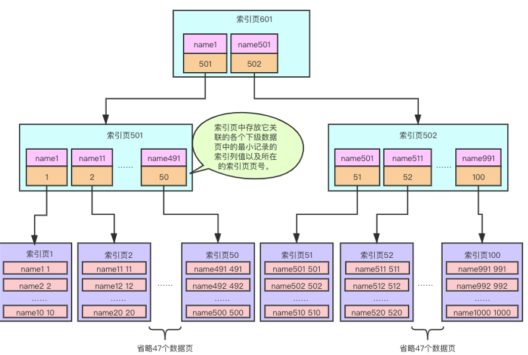

上面的图，我们也是约定最底层的叶子节点所在的索引页最多放10条记录，其它非叶子节点所在的索引页最多放50条记录。由于总共有1000条学生记录，那么叶子节点的索引页总共是100个，然后第二层的索引页每页可以放50条记录，就有2个索引页，最顶层的索引里面只有2条记录分别关联着第二层的两个索引页。

对着上面的图，我们再来看下如果要查找name=name1000的这个学生记录，要怎么来查找呢？首先在最顶层的索引页601中判断，name1000大于name501（MySQL内部会有指定的字符集与排序比较规则来对非数值类型的值进行比较大小的，也可以在建表的时候自己指定字符集与排序比较规则。

比如DEFAULT CHARSET=utf8mb4 COLLATE=utf8mb4_bin），说明目标记录在name=name501关联的下级索引页中，也就是索引页502，接着到索引502中来判断，name1000大于name901，说明目标记录在name=name991关联的下级索引页中，也就是索引页100，最后到叶子节点的索引页100中去查找，由于索引页内部的记录也是有单向链表这个机制的，所以沿着单向链表一路遍历下去，最终就可以快速的找到目标记录了，像下图这样：

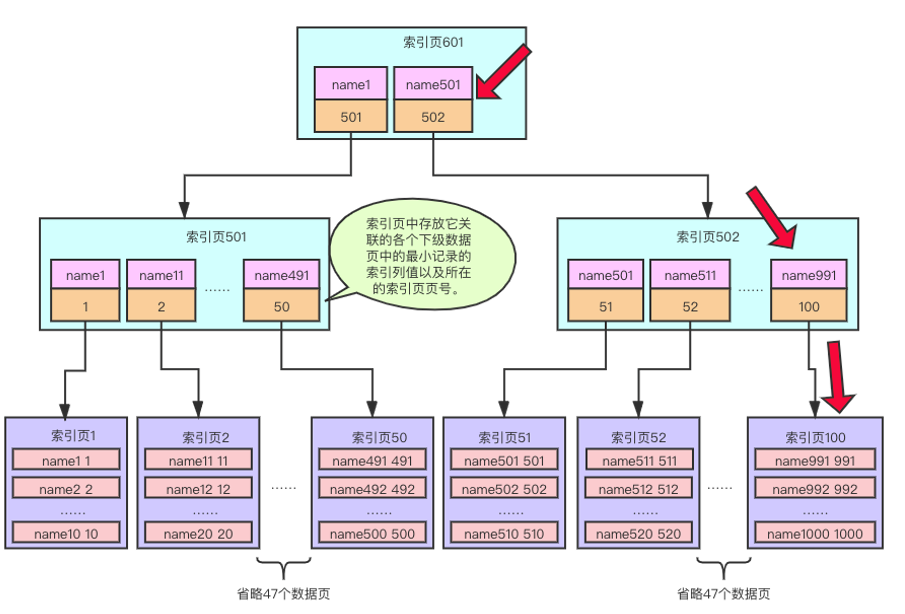

但是此时要注意了，由于我们在上图索引页中100中找到的记录是没有存储完整的用户记录信息的，只能获取到这个目标记录的主键ID值，所以如果想获取到name=name1000所在记录的完整信息，还需要拿着主键ID=1000去到聚族索引中进行再次查询一下，这个过程也叫做**回表查询**。

特别说明：由于举例的表比较简单就只有id跟name两个列，所以不用回表查询也可以，这种场景也叫做**覆盖索引**。

到这里基本上就把根据普通列作为查询条件时利用非聚族索引查找数据的过程也介绍完了，MySQL内部查找数据的原理主要就是这些内容，不过还是有些内容补充说明一下：

• 普通列跟主键ID列不一样，主键ID一定是不为NULL且值不会重复的，但是普通的列如果创建的不是唯一索引的话，值可能是重复的，即使是唯一索引，也可能存在多个为NULL的记录。

• 如果普通列的值存在重复的话，那么在非聚族索引的叶子节点中存放的记录会先按列值排序，列值一致的会再按主键ID进行排序。

• 如果非叶子节点中也存在不同记录的列值相同的情况的话，那么在非叶子节点中就不仅仅只存储下级节点中最小记录的列值与索引页号了，也会把这个记录的ID值也存储一下，以方便记录排序。

• MySQL是允许同时给多个普通列建立联合索引的，这个时候其实查找数据的原理还是一样的，就是非聚族索引的节点上存储的就是多个列的值了，而且节点内数据排序规则编程了先按第一个列的值进行排序，第一个列的值相同的时候再按下一个列的值进行排序，如果所有列的值都相同，最后就按记录所在的主键ID进行排序。

### 2.3 使用uuid和自增id的索引结构对比

#### 2.3.1 使用自增id的内部结构

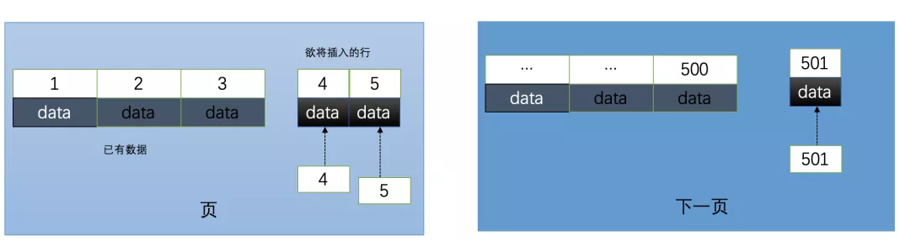

自增的主键的值是顺序的,所以Innodb把每一条记录都存储在一条记录的后面。当达到页面的最大填充因子时候(innodb默认的最大填充因子是页大小的15/16,会留出1/16的空间留作以后的修改)：

①. 下一条记录就会写入新的页中，一旦数据按照这种顺序的方式加载，主键页就会近乎于顺序的记录填满，提升了页面的最大填充率，不会有页的浪费
②. 新插入的行一定会在原有的最大数据行下一行,mysql定位和寻址很快，不会为计算新行的位置而做出额外的消耗
③. 减少了页分裂和碎片的产生

**2.2 使用uuid的索引内部结构**

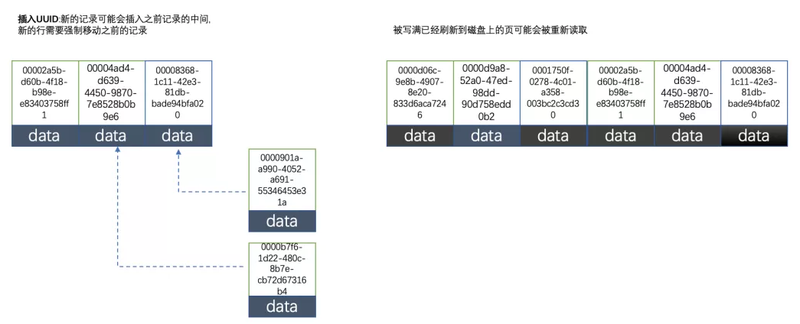

因为uuid相对顺序的自增id来说是毫无规律可言的,新行的值不一定要比之前的主键的值要大,所以innodb无法做到总是把新行插入到索引的最后,而是需要为新行寻找新的合适的位置从而来分配新的空间。这个过程需要做很多额外的操作，数据的毫无顺序会导致数据分布散乱，将会导致以下的问题：

**①.** 写入的目标页很可能已经刷新到磁盘上并且从缓存上移除，或者还没有被加载到缓存中，innodb在插入之前不得不先找到并从磁盘读取目标页到内存中，这将导致大量的随机IO
**②.** 因为写入是乱序的,innodb不得不频繁的做页分裂操作,以便为新的行分配空间,页分裂导致移动大量的数据，一次插入最少需要修改三个页以上
**③.** 由于频繁的页分裂，页会变得稀疏并被不规则的填充，最终会导致数据会有碎片

在把随机值（uuid和雪花id）载入到聚簇索引(innodb默认的索引类型)以后,有时候会需要做一次OPTIMEIZE TABLE来重建表并优化页的填充，这将又需要一定的时间消耗。
结论：使用innodb应该尽可能的按主键的自增顺序插入，并且尽可能使用单调的增加的聚簇键的值来插入新行

**2.3 使用自增id的缺点**

那么使用自增的id就完全没有坏处了吗？并不是，自增id也会存在以下几点问题：
①. 别人一旦爬取你的数据库,就可以根据数据库的自增id获取到你的业务增长信息，很容易分析出你的经营情况
②. 对于高并发的负载，innodb在按主键进行插入的时候会造成明显的锁争用，主键的上界会成为争抢的热点，因为所有的插入都发生在这里，并发插入会导致间隙锁竞争
③. Auto_Increment锁机制会造成自增锁的抢夺,有一定的性能损失

## 3. 性能优化

### 3.1 索引优化

引用：https://www.processon.com/preview/60ed31a763768906ea1fd2ef