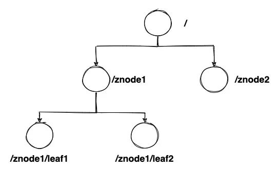
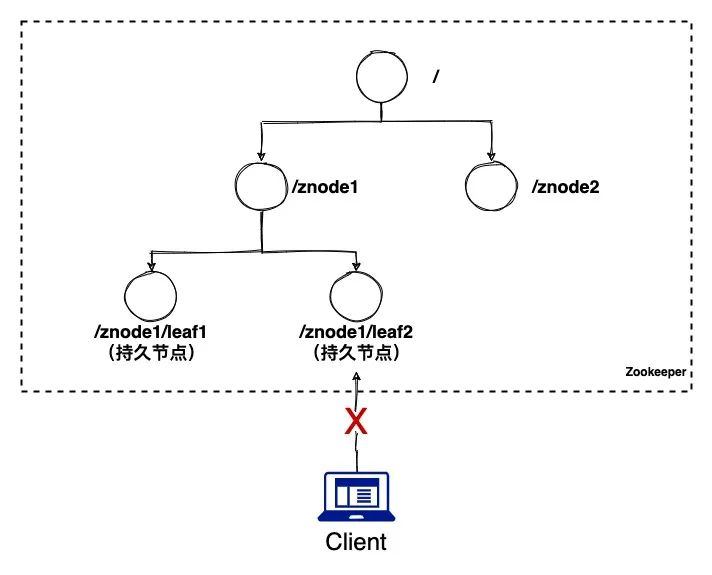
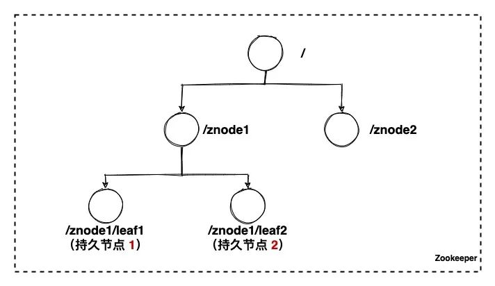
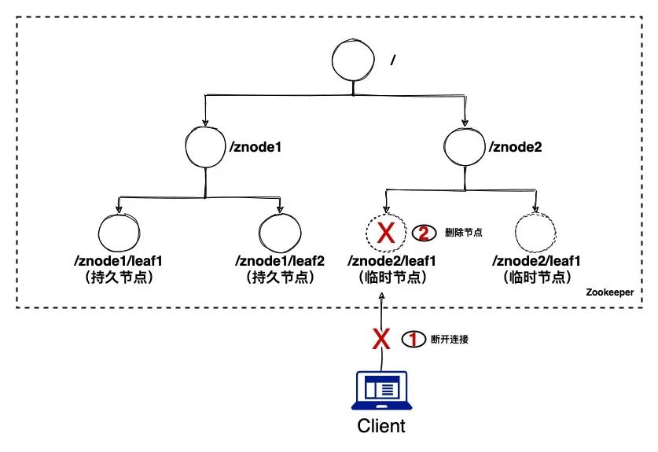
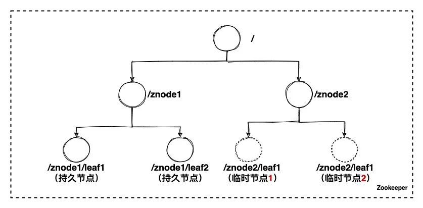
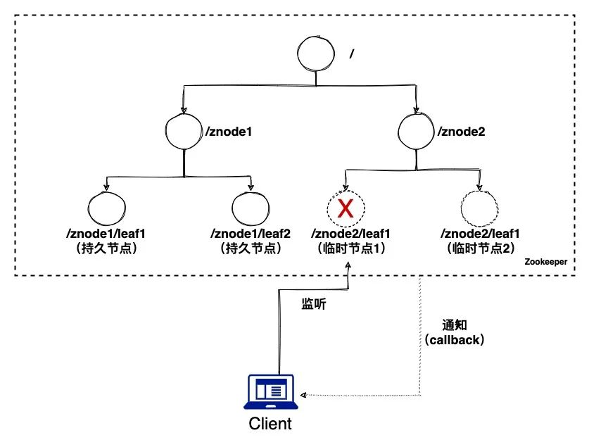
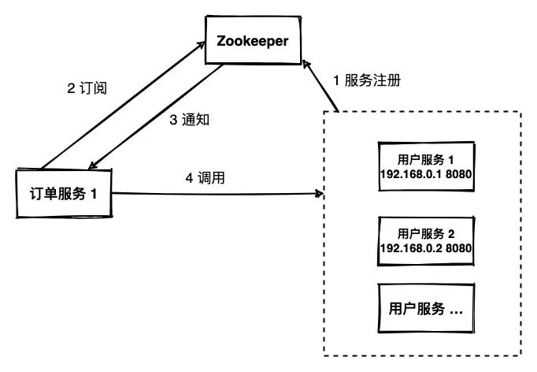
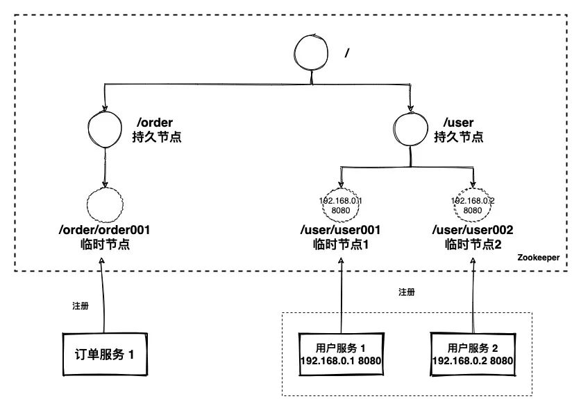
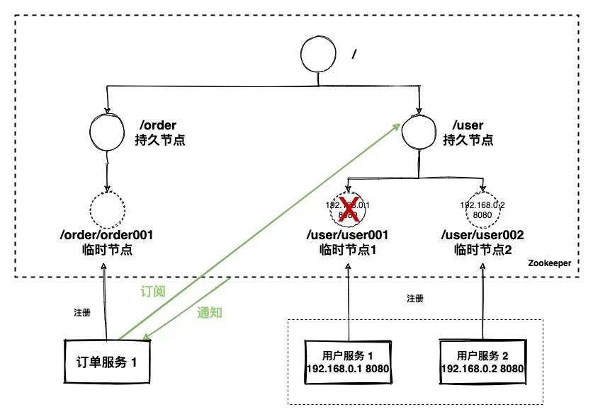

# 图解Zookeeper服务注册

## 1. 服务注册简述

**Zookeeper 是一个分布式的、开源的分布式应用程序协调服务。**

作为一个协调服务，常常用来配合其他中间件来用，比如：Dubbo + Zookeeper，Hadoop + Zookeeper等，Zookeeper可以实现：服务注册发现、分布式锁、配置中心等功能。

着重说一下 Zookeeper 是如何实现服务注册发现的。

### 1.1 **分布式带来的问题**

先正式介绍 Zookeeper 之前，我们先引入一个业务场景：**订单服务**需要调用**用户服务**的接口。

要实现这个功能非常简单，我们只需要知道**用户服务**的 ip 和 port 就可以了。

突然有一天，用户数量激增，**用户服务**扛不住了，这个时候只能进行扩容，多部署几个实例，这个时候问题就来了，订单服务该调用哪个用户服务的实例？

最简单的办法就是在订单服务中配置所有的用户服务实例，然后使用某种算法（比如说轮询）从配置列表中选择一个就可以了。

看似问题解决了，其实隐患很大：

- 用户服务的实例数会根据负载进行动态调整，每次调整完都要更新配置列表，非常麻烦，也容易出错。
- 某些服务实例 down 掉了，如果没来得及从配置列表中清除掉，就会造成调用者请求接口报错。

如何解决呢？往往解决这类分布式问题都需要一块公共的区域来保存这些信息。

### 1.2 **用 Redis 解决**

需要一块公共的区域保存这些信息，那利用 Redis 是否可以实现？

每个服务实例启动之后都向 Redis 注册信息，停止时也从 Redis 中删除数据。

存放在 Redis 中的信息简单来说就是服务实例的 ip + port，订单服务需要调用用户服务时直接从 Redis 中获取即可。

简单流程如下图所示：

每次调用的时候都去 Redis 查询一次，频繁的查询可能会导致性能瓶颈，为了解决这个问题我们可以在查询之后在本地缓存一份数据，这样每次调用可以优先从本地获取数据。

但这样又会出现新的问题，本地缓存如何刷新呢，如果服务提供者某些实例 down 掉了或者扩容新增了一批实例，那服务消费者如何才能快速感知到呢？

要想解决这个问题，最先想到的一个办法就是让服务消费者定时轮询 Redis，发现有更新了就去更新本地缓存，看起来也能解决本地缓存刷新的问题，但是多久轮询一次呢，1 秒或者10 秒？

轮询时间太短依然有性能瓶颈问题，这样本地缓存也没有存在的必要了；轮询时间太长，本地缓存来不及更新，就会存在 "脏" 数据。

以上的方案都不完美，并且不优雅，主要有以下几点：

- 基于定时任务会导致很多无效的查询。
- 定时任务存在周期性，没法做到实时，这样就可能存在请求异常。
- 如果服务被强行 kill，没法及时清除 Redis，这样这个看似可用的服务将永远不可用！

所以我们需要一个更加靠谱的解决方案。

### 1.3 **用 Zookeeper 解决**

用过 Dubbo 的小伙伴对这张图肯定很熟悉，步骤 0 到 4 是服务注册发现的核心流程。

这个流程与我们上面讨论的不谋而合，那 Dubbo 是如何实现的呢？实际上 Dubbo 作为一个通用的框架提供了多种解决方案，如：Zookeeper、Nacos等。

不管是哪种方案，总结起来都是一种套路，基本流程如下：

- 每个服务实例启动之后将自己的信息（ip+port）写入公共区域；
- 调用者订阅自己感兴趣的服务实例，获取服务实例信息列表后缓存在自己本地；
- 服务实例停止或者 down 调后将公共区域自己的信息清除掉；
- 公共区域通知调用者你感兴趣的信息已经发生变更，请更新一下本地的缓存。

## 2. **Zookeeper的重点特性**

### **（1）树状目录结构**

**Zookeeper**是一个树状的文件目录结构，与 Unix 文件系统很类似。树中每个节点可以称作为一个ZNode，每一个ZNode都可以通过其路径唯一标识，最重要的是我们可以对每个 ZNode 进行增删改查。

### **（2）持久节点(Persistent)**

客户端与**Zookeeper**服务端断开连接后，节点仍然存在不会被删除，这样的节点就叫做**持久节点**。

### **（3）持久有序节点(Persistent_sequential)**

持久有序节点是在上面持久节点的特性上加上了有序性，**有序性**的意思是服务向Zookeeper注册信息时，Zookeeper 根据注册顺序给每个节点编号。

### **（4）临时节点(Ephemeral)**

客户端与**Zookeeper**服务端断开连接后，该节点被删除。

**注意:临时节点下不存在子节点；持久节点下可以存在临时节点。**

### **（5）临时有序节点(Ephemeral_sequential)**

临时有序节点是在临时节点的基础上再加上有序性，跟持久有序节点类似。

### **（6）节点监听(Wacher)**

**节点监听**是Zookeeper最重要的特性之一，客户端可以监听任意节点，节点有任何变化 Zookeeper 可以通过回调的方式通知给客户端，这样客户端不用轮询就可以及时感知节点变化。

如下图所示，客户端（client）开始监听临时节点 1，因某种原因临时节点 1 被删除了，Zookeeper 通过回调将变化通知给 client 了。

## 3. **Zookeeper 实现服务注册发现**

了解了Zookeeper的一些重要特性，我们再来看下 Zookeeper 是如何实现服务注册和发现的。还是以订单服务、用户服务的场景为例。

服务提供方（用户服务）启动成功后将服务信息注册到Zookeeper，服务信息包括实例的 ip、端口等元信息。注册成功 Zookeeper 还可以通过心跳监测来动态感知实例变化，详细的过程这里不展开。

服务消费方（订单服务）需要调用用户服务的接口，但因为不知道实例的 ip、端口等信息，只能从 Zookeeper 中获取调用地址列表，然后进行调用，这个过程成为服务的**订阅**。

订阅成功后服务消费方可以将调用列表缓存在本地，这样不用每次都去调用 Zookeeper 获取。一旦 Zookeeper感知到用户服务实例变化后就会通知给服务消费方，服务消费方拿到结果后就会更新本地缓存，这个过程称之为**通知**。

### 3.1 **服务注册原理**

服务启动后会自动向 Zookeeper 注册，注册的规则如下：

每个服务会创建一个持久节点和若干个临时节点。比如：用户服务首先创建一个持久节点 user，然后每个服务实例会在持久节点下创建一个临时有序节点。

### 3.2 **服务动态发现原理**

由于订单服务需要调用用户服务的接口，所以订单服务会订阅 user 节点，一旦用户服务有变化（增加实例或者减少实例），Zookeeper 都会将最新的列表信息推送给订单服务，这个过程就是服务动态发现的基本原理。少用文字描述，大家直接看图：

