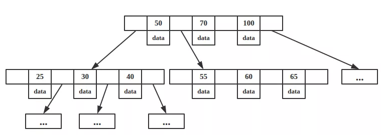
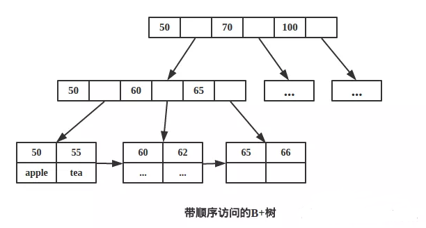

# B树与B+树

## 一. B树

B-树是一种自平衡的搜索树，形式很简单：

这就是一颗B-树。针对我们这个问题的最核心的特点如下：
（1）多路，非二叉树
（2）每个节点既保存索引，又保存数据
（3）搜索时相当于二分查找

## 二. B+树

B+树是B-树的变种

最核心的特点如下：
（1）多路非二叉
（2）只有叶子节点保存数据
（3）搜索时相当于二分查找
（4）增加了相邻接点的指向指针。

从上面我们可以看出最核心的区别主要有俩，一个是数据的保存位置，一个是相邻节点的指向。

## 三. B-树和B+树的区别
- B+树内节点不存储数据，所有数据存储在叶节点导致查询时间复杂度固定为 log n。
- B-树查询时间复杂度不固定，与 key 在树中的位置有关，最好为O(1)。
- B+树叶节点两两相连可大大增加区间访问性，可使用在范围查询等。
- B-树每个节点 key 和 data 在一起，则无法区间查找。
- B+树更适合外部存储(存储磁盘数据)。由于内节点无 data 域，每个节点能索引的范围更大更精确。