# 概述JVM
## **一. JVM内存区域的划分**

### **1.1 java虚拟机运行时数据区**

**java虚拟机运行时数据区分布图：**

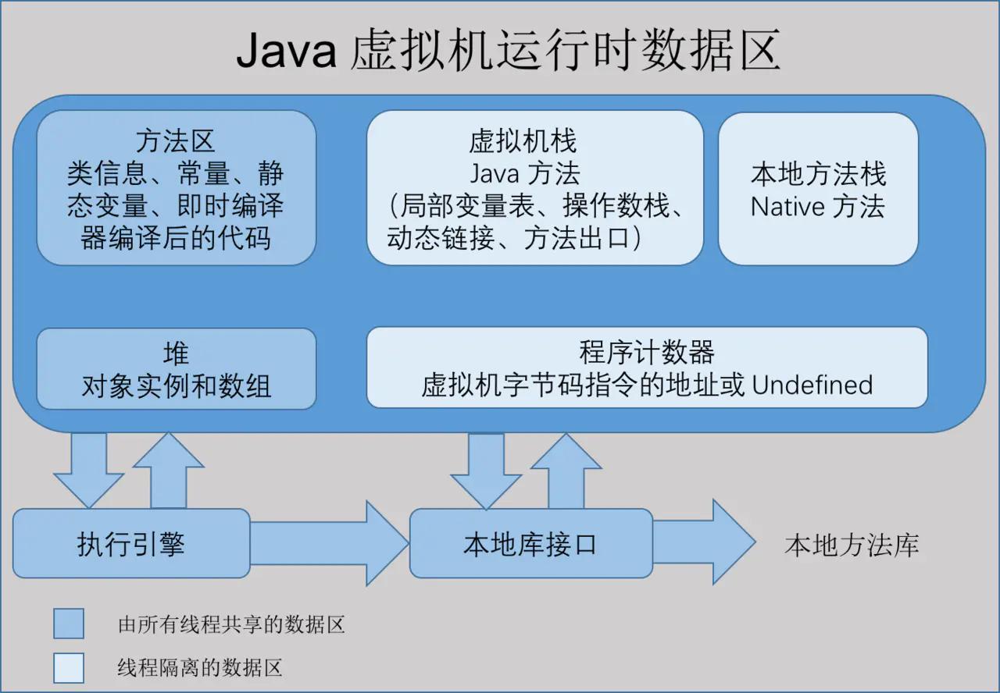

- **JVM栈（Java Virtual Machine Stacks）：** Java中一个线程就会相应有一个线程栈与之对应，因为不同的线程执行逻辑有所不同，因此需要一个独立的线程栈，因此栈存储的信息都是跟当前线程（或程序）相关信息的，包括**局部变量**、**程序运行状态**、**方法返回值**、**方法出口**等等。每一个方法被调用直至执行完成的过程，就对应着一个栈帧在虚拟机栈中从入栈到出栈的过程。
- **堆（Heap）：** 堆是所有线程共享的，主要是存放对象实例和数组。处于**物理上不连续**的内存空间，只要**逻辑连续**即可
- **方法区（Method Area）：** 属于共享内存区域，存储已被虚拟机加载的类信息、常量、静态变量、即时编译器编译后的代码等数据
- **常量池（Runtime Constant Pool）：** 它是方法区的一部分，用于存放编译期生成的各种字面量和符号引用。
- **本地方法栈（Native Method Stacks）：**

其中，**堆(Heap)和JVM栈**是**程序运行的关键**,因为：

1. 栈是运行时的单位（解决程序的运行问题，即程序如何执行，或者说如何处理数据），而堆是存储的单位（解决的是数据存储的问题，即数据怎么放、放在哪儿）。
2. 堆存储的是对象。栈存储的是基本数据类型和堆中对象的引用；（参数传递的值传递和引用传递）

**那为什么要把堆和栈区分出来呢？栈中不是也可以存储数据吗？**

1. 从软件设计的角度看，栈代表了处理逻辑，而堆代表了数据，分工明确，处理逻辑更为清晰体现了“分而治之”以及“隔离”的思想。
2. 堆与栈的分离，使得堆中的内容可以被多个栈共享（也可以理解为多个线程访问同一个对象）。这样共享的方式有很多收益：提供了一种有效的数据交互方式(如：共享内存)；堆中的共享常量和缓存可以被所有栈访问，节省了空间。
3. 栈因为运行时的需要，比如保存系统运行的上下文，需要进行地址段的划分。由于栈只能向上增长，因此就会限制住栈存储内容的能力。而堆不同，堆中的对象是可以根据需要动态增长的，因此栈和堆的拆分，使得动态增长成为可能，相应栈中只需记录堆中的一个地址即可。
4. 堆和栈的结合完美体现了面向对象的设计。当我们将对象拆开，你会发现，对象的属性即是数据，存放在堆中；而对象的行为（方法）即是运行逻辑，放在栈中。因此编写对象的时候，其实即编写了数据结构，也编写的处理数据的逻辑。

### **1.2 堆(Heap)和JVM栈：**

**1.2.1 堆(Heap)**

**Java堆**是java虚拟机所管理内存中**最大的一块内存空间**，处于**物理上不连续**的内存空间，只要**逻辑连续**即可，主要用于存放各种类的实例对象。该区域被所有线程共享，在虚拟机启动时创建，用来存放对象的实例，几乎所有的对象以及数组都在这里分配内存（栈上分配、标量替换优化技术的例外）。

  在 Java 中，堆被划分成两个不同的区域：**新生代 ( Young )**、**老年代 ( Old )**。**新生代 ( Young )** 又被划分为三个区域：**Eden**、**From Survivor(S0)**、**To Survivor(S1)**。如图所示：

**堆的内存布局:**

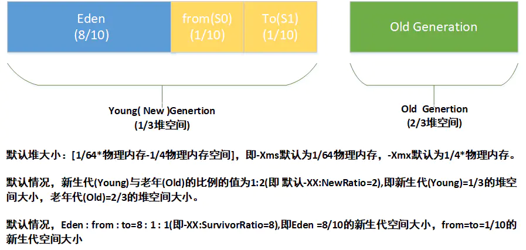

  这样划分的目的是为了使jvm能够更好的管理内存中的对象，包括内存的分配以及回收。 而新生代按eden和两个survivor的分法，是为了

- 有效空间增大，eden+1个survivor；
- 有利于对象代的计算，当一个对象在S0/S1中达到设置的XX:MaxTenuringThreshold值后，会将其挪到老年代中，即只需扫描其中一个survivor。如果没有S0/S1,直接分成两个区，该如何计算对象经过了多少次GC还没被释放。
- 两个Survivor区可解决内存碎片化

**1.2.2 堆栈相关的参数**

| **参数**                       | **描述**                                                     |
| ------------------------------ | ------------------------------------------------------------ |
| -Xms                           | 堆内存初始大小，单位m、g                                     |
| -Xmx                           | 堆内存最大允许大小，一般不要大于物理内存的80%                |
| -Xmn                           | 年轻代内存初始大小                                           |
| -Xss                           | 每个线程的堆栈大小，即JVM栈的大小                            |
| -XX:NewRatio                   | 年轻代(包括Eden和两个Survivor区)与年老代的比值               |
| -XX:NewSzie(-Xns)              | 年轻代内存初始大小,可以缩写-Xns                              |
| -XX:MaxNewSize(-Xmx)           | 年轻代内存最大允许大小，可以缩写-Xmx                         |
| -XX:SurvivorRatio              | 年轻代中Eden区与Survivor区的容量比例值，默认为8，即8:1       |
| -XX:MinHeapFreeRatio           | GC后，如果发现空闲堆内存占到整个预估堆内存的40%，则放大堆内存的预估最大值，但不超过固定最大值。 |
| -XX:MaxHeapFreeRatio           | 预估堆内存是堆大小动态调控的重要选项之一。堆内存预估最大值一定小于或等于固定最大值(-Xmx指定的数值)。前者会根据使用情况动态调大或缩小，以提高GC回收的效率，默认70% |
| -XX:MaxTenuringThreshold       | 垃圾最大年龄，设置为0的话,则年轻代对象不经过Survivor区,直接进入年老代。对于年老代比较多的应用,可以提高效率.如果将此值设置为一个较大值,则年轻代对象会在Survivor区进行多次复制,这样可以增加对象再年轻代的存活 时间,增加在年轻代即被回收的概率 |
| -XX:InitialTenuringThreshold   | 可以设定老年代阀值的初始值                                   |
| -XX:+PrintTenuringDistribution | 查看每次minor GC后新的存活周期的阈值                         |

**Note：** 每次GC 后会调整堆的大小，为了**防止动态调整带来的性能损耗**，一般设置-**Xms、-Xmx 相等**。

    新生代的三个设置参数：-Xmn，-XX:NewSize，-XX:NewRatio的优先级：

    （1）.最高优先级： -XX:NewSize=1024m和-XX:MaxNewSize=1024m

    （2）.次高优先级： -Xmn1024m （默认等效效果是：-XX:NewSize==-XX:MaxNewSize==1024m）

    （3）.最低优先级：-XX:NewRatio=2

  推荐使用的是-Xmn参数，原因是这个参数很简洁，相当于一次性设定NewSize和MaxNewSIze，而且两者相等。

### **1.3 jvm对象**

**1.3.1 创建对象的方式**

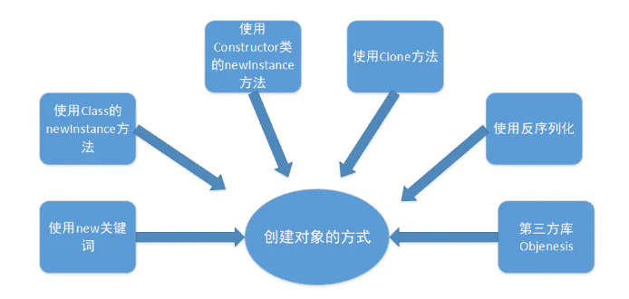

各个方式的实质操作如下：

| **方式**                           | **实质**                                                     |
| ---------------------------------- | ------------------------------------------------------------ |
| 使用new关键                        | 调用无参或有参构造器函数创建                                 |
| 使用Class的newInstance方法         | 调用无参或有参构造器函数创建，且需要是publi的构造函数        |
| 使用Constructor类的newInstance方法 | 调用有参和私有private构造器函数创建，实用性更广              |
| 使用Clone方法                      | 不调用任何参构造器函数，且对象需要实现Cloneable接口并实现其定义的clone方法，且默认为浅复制 |
| 第三方库Objenesis                  | 利用了asm字节码技术，动态生成Constructor对象                 |

**1.3.2 jvm对象分配**

在虚拟机层面上创建对象的步骤：

| **步骤**                                  | **解析**                                                     |
| ----------------------------------------- | ------------------------------------------------------------ |
| 1、判断对象对应的类是否加载、链接、初始化 | 虚拟机遇到一条new指令，首先去检查这个指令的参数能否在常量池中定位到一个类的符号引用，并且检查这个符号引用代表的类是否已经被加载、解析和初始化。如果没有，那么必须先执行类的加载、解释、初始化（类的clinit方法）。 |
| 2、为对象分配内存                         | 类加载检查通过后，虚拟机为新生对象分配内存。对象所需内存大小在类加载完成后便可以完全确定，为对象分配空间无非就是从Java堆中划分出一块确定大小的内存而已。 |
| 3、处理并发安全问题                       | 另外一个问题及时保证new对象时候的线程安全性：创建对象是非常频繁的操作，虚拟机需要解决并发问题。 虚拟机采用了两种方式解决并发问题:（1）CAS配上失败重试的方式保证指针更新操作的原子性;（2）TLAB 把内存分配的动作按照线程划分在不同的空间之中进行，即每个线程在Java堆中预先分配一小块内存，称为本地线程分配缓冲区，（TLAB ，Thread Local Allocation Buffer）虚拟机是否使用TLAB，可以通过-XX:+/-UseTLAB参数来设定。 |
| 4、初始化分配到的空间                     | 内存分配结束，虚拟机将分配到的内存空间都初始化为零值（不包括对象头）。这一步保证了对象的实例字段在Java代码中可以不用赋初始值就可以直接使用，程序能访问到这些字段的数据类型所对应的零值 |
| 5、设置对象的对象头                       | 将对象的所属类（即类的元数据信息）、对象的HashCode和对象的GC分代年龄等数据存储在对象的对象头中 |
| 6、执行init方法进行初始化                 | 在Java程序的视角看来，初始化才正式开始，开始调用方法完成初始赋值和构造函数，所有的字段都为零值。因此一般来说（由字节码中是否跟随有invokespecial指令所决定），new指令之后会接着就是执 行方法，把对象按照程序员的意愿进行初始化，这样一个真正可用的对象才算完全创建出来。 |

**1.3.3 对象分配内存方式**

**分配对象内存**，**有两种分配方式**，**指针碰撞**和**空闲列表**：

（1）如果内存是规整的，那么虚拟机将采用的是指针碰撞法（Bump The Pointer）来为对象分配内存。意思是所有用过的内存在一边，空闲的内存在另外一边，中间放着一个指针作为分界点的指示器，分配内存就仅仅是把指针向空闲那边挪动一段与对象大小相等的距离罢了。如果垃圾收集器选择的是Serial、ParNew这种基于压缩算法的，虚拟机采用这种分配方式。一般使用带有compact（整理）过程的收集器时，使用指针碰撞。

（2）如果内存不是规整的，已使用的内存和未使用的内存相互交错，那么虚拟机将采用的是空闲列表法来为对象分配内存。意思是虚拟机维护了一个列表，记录上哪些内存块是可用的，再分配的时候从列表中找到一块足够大的空间划分给对象实例，并更新列表上的内容。这种分配方式成为“空闲列表（Free List）”。

**Note：** 选择哪种分配方式由Java堆是否规整决定，而Java堆是否规整又由所采用的垃圾收集器是否带有压缩整理功能决定。

**1.3.4 那什么样的对象能够进入老年代(Old)**

**那什么样的对象能够进入老年代(Old)？**

​    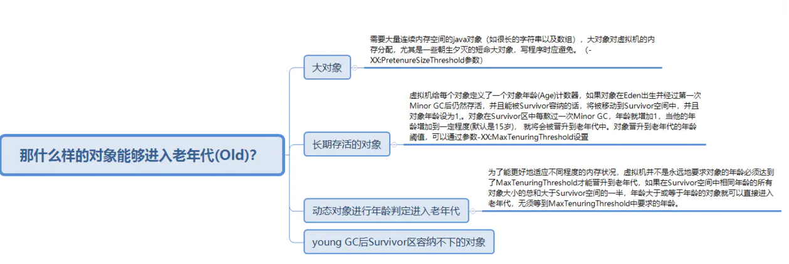

### **1.4 内存分配与回收策略**

| **情况**                         | **解析**                                                     |
| -------------------------------- | ------------------------------------------------------------ |
| 1.对象优先在Eden分配             | 大多数情况下，对象在新生代Eden区中分配，当Eden区没有足够的空间进行分配时，虚拟机将发起一次Minor GC；虚拟机提供了-XX:PrintGCDetails参数，发生垃圾回收时打印内存回收日志，并且在进程退出时输出当前内存各区域的分配情况。 |
| 2.大对象直接进入老年代           | 所谓的大对象就是指，需要大量连续内存空间的java对象，最典型的大对象就是那种很长的字符串及数组。虚拟机提供了一个-XX:PretenureSizeThreshold参数，令大于这个设置值得对象直接在老年代中分配（这样做的目的是避免在Eden区及两个Survivor之间发生大量的内存拷贝） |
| 3.长期存活的对象将直接进入老年代 | 对象年龄计数器。-XX:MaxTenuringThreshold                     |
| 4、动态对象年龄判定              | 虚拟机并不总是要求对象的年龄必须达到MaxTenuringThreshold才能晋升老年代，如果在Survivor空间中相同年龄所有对象大小的总和大于Survivor空间的一半，年龄大于或等于该年龄的对象就可以直接进入老年代，无需等到MaxTenuringThreshold中要求的年龄。 |
| 5、空间分配担保                  | 在发生Minor GC时（前），虚拟机会检测之前每次晋升到老年代的平均大小（因为当次会有多少对象会存活是无法确定的，所以取之前的平均值/经验值）是否大于老年代的剩余空间大小，如果大于，则改为直接进行一次Full GC。如果小于，则查看HandlePromotionFailure设置是否允许担保失败；如果允许，那只会进行Minor GC；如果不允许，则也要改为进行一次Full GC。取平均值进行比较其实仍然是一种动态概率手段，也就是说如果某次Minor GC存活后的对象突增，远远高于平均值的话，依然会导致担保失败（Handle Promotion Failure），这样会触发Full GC。 |

## **二 垃圾回收算法分类**

### **2.1 引用**

​    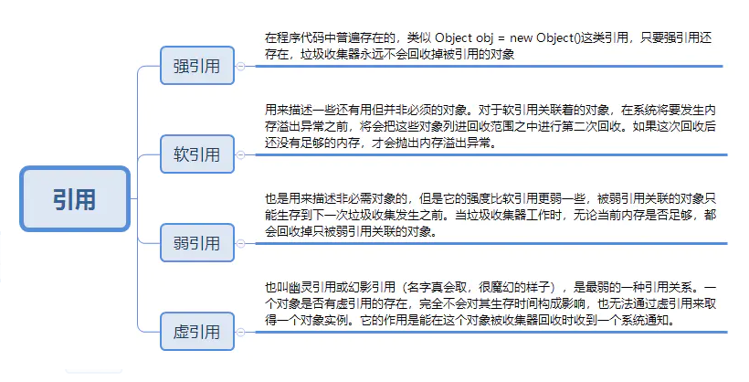

### **2.2 GC Root的对象**

​    

### **2.3 标记-清除（Mark—Sweep）**

被誉为现代垃圾回收算法的思想基础。

​    

**标记-清除算法**采用从根集合进行扫描，对存活的对象对象标记，标记完毕后，再扫描整个空间中未被标记的对象，进行回收，如上图所示。标记-清除算法不需要进行对象的移动，并且仅对不存活的对象进行处理，在存活对象比较多的情况下极为高效，但由于标记-清除算法直接回收不存活的对象，因此会造成内存碎片。

### **2.4 复制算法（Copying）**

  该算法的提出是为了克服句柄的开销和解决堆碎片的垃圾回收。建立在存活对象少，垃圾对象多的前提下。此算法每次只处理正在使用中的对象，因此复制成本比较小，同时复制过去后还能进行相应的内存整理，不会出现碎片问题。但缺点也是很明显，就是需要两倍内存空间。

  它开始时把堆分成 一个对象 面和多个空闲面， 程序从对象面为对象分配空间，当对象满了，基于copying算法的垃圾 收集就从根集中扫描活动对象，并将每个活动对象复制到空闲面(使得活动对象所占的内存之间没有空闲洞)，这样空闲面变成了对象面，原来的对象面变成了空闲面，程序会在新的对象面中分配内存。一种典型的基于coping算法的垃圾回收是stop-and-copy算法，它将堆分成对象面和空闲区域面，在对象面与空闲区域面的切换过程中，程序暂停执行。

### **2.5 标记-整理**

    或标记-压缩算法，Mark-Compact，又或者叫标记清除压缩MarkSweepCompact

  此算法是结合了“标记-清除”和“复制算法”两个算法的优点。避免了“标记-清除”的碎片问题，同时也避免了“复制”算法的空间问题。

​    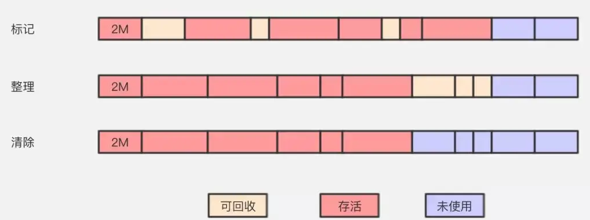

标记-整理算法采用标记-清除算法一样的方式进行对象的标记，但在清除时不同，在回收不存活的对象占用的空间后，会将所有的存活对象往左端空闲空间移动，并更新对应的指针。标记-整理算法是在标记-清除算法的基础上，又进行了对象的移动，因此成本更高，但是却解决了内存碎片的问题。在基于Compacting算法的收集器的实现中，一般增加句柄和句柄表。

### **2.6 分代回收策略（Generational Collecting）**

  基于这样的事实：不同的对象的生命周期是不一样的。因此，不同生命周期的对象可以采取不同的回收算法，以便提高回收效率。

  新生代由于其对象存活时间短，且需要经常gc，因此采用效率较高的复制算法，其将内存区分为一个eden区和两个suvivor区，默认eden区和survivor区的比例是8:1，分配内存时先分配eden区，当eden区满时，使用复制算法进行gc，将存活对象复制到一个survivor区，当一个survivor区满时，将其存活对象复制到另一个区中，当对象存活时间大于某一阈值时，将其放入老年代。老年代和永久代因为其存活对象时间长，因此使用标记清除或标记整理算法

**总结：**

- 新生代：复制算法（新生代回收的频率很高，每次回收的耗时很短，为了支持高频率的新生代回收，虚拟机可能使用一种叫做卡表（Card Table）的数据结构，卡表为一个比特位集合，每个比特位可以用来表示老年代的某一区域中的所有对象是否持有新生代对,

### **2.7 垃圾回收器**

**垃圾回收器**的任务是识别和回收垃圾对象进行内存清理，不同代可使用不同的收集器：

- **新生代收集器**使用的收集器：**Serial、ParNew、Parallel Scavenge**；
- **老年代收集器**使用的收集器：**Serial Old（MSC）、Parallel Old、CMS。**

**总结：**

1. **Serial old和新生代的所有回收器都能搭配；也可以作为CMS回收器的备用回收器；**
2. **CMS只能和新生代的Serial和ParNew搭配，而且ParNew是CMS默认的新生代回收器；**
3. **并行（Parallel）：指多条垃圾收集线程并行工作，但此时用户线程仍然处于等待状态**
4. **并发（Concurrent）：指用户线程和垃圾收集线程同时执行（但不一定是并行的，可能是交替执行），用户程序继续运行，而垃圾收集程序运行在另外的CPU上。**

## **三. GC的执行机制**

  Java 中的**堆(deap)** 也是 GC 收集垃圾的主要区域。由于对象进行了分代处理，因此垃圾回收区域、时间也不一样。GC有两种类型：**Scavenge GC（Minor GC）和Full GC（Major GC）**。

- **Scavenge GC(Minor GC):** 一般情况下，当新对象生成（age=0），并且在Eden申请空间失败时，就会触发Scavenge GC，对Eden区域进行GC，清除非存活对象，并且把尚且存活的对象移动到Survivor区（age+1）。然后整理（其实是复制过去就顺便整理了）Survivor的两个区。这种方式的GC是对年轻代的Eden区进行，不会影响到年老代。因为大部分对象都是从Eden区开始的，同时Eden区不会分配的很大，所以Eden区的GC会频繁进行。因而，一般在这里需要使用速度快、效率高的算法（即复制-清理算法），使Eden去能尽快空闲出来。Java 中的大部分对象通常不需长久存活，具有朝生夕灭的性质。
- **Full GC:**对整个堆进行整理，包括Young、Tenured和Perm。Full GC因为需要对整个对进行回收，所以比Scavenge GC要慢，因此应该尽可能减少Full GC的次数。在对JVM调优的过程中，很大一部分工作就是对于FullGC的调节。

### **3.1 触发Full GC执行的场景**

​    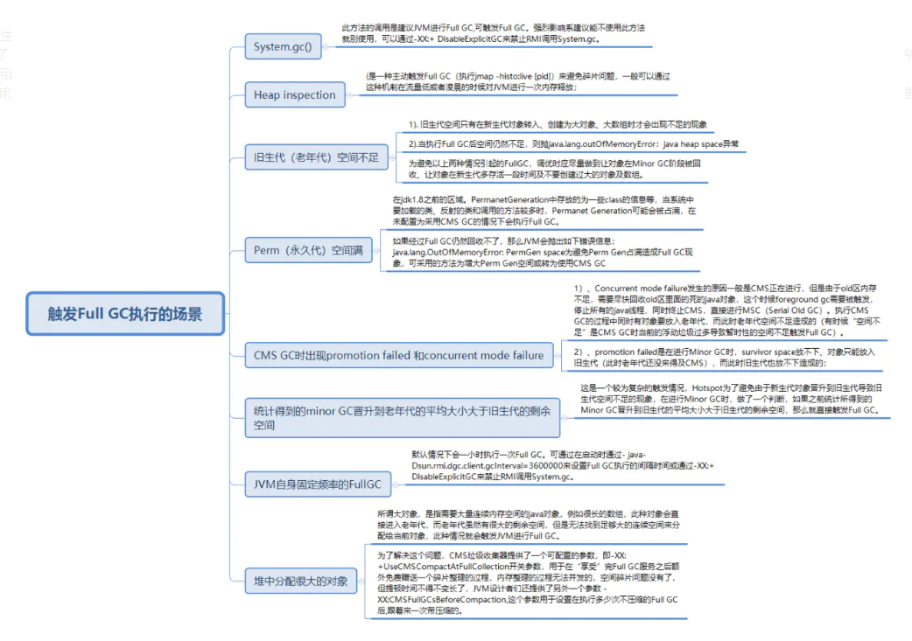

### **3.2 Young GC触发条件**

​    

### **3.3 新生对象GC收回流程**

  基于大多数新生对象都会在GC中被收回的假设。新生代的GC 使用复制算法，（将年轻代分为3部分，主要是为了生命周期短的对象尽量留在年轻代。老年代主要存放生命周期比较长的对象，比如缓存）。可能经历过程：

1. **对象创建时，一般在Eden区完成内存分配（有特殊）；**
2. **当Eden区满了，再创建对象，会因为申请不到空间，触发minorGC，进行young(eden+1survivor)区的垃圾回收；**
3. **minorGC时，Eden和survivor A不能被GC回收且年龄没有达到阈值（tenuring threshold）的对象，会被放入survivor B，始终保证一个survivor是空的；**
4. **当做第3步的时候，如果发现survivor满了，将这些对象copy到old区（分配担保机制）；或者survivor并没有满，但是有些对象已经足够Old，也被放入Old区 XX:MaxTenuringThreshold；（回顾下对象进入老年代的情况）**
5. **直接清空eden和survivor A；**
6. **当Old区被放满的之后，进行fullGC。**

### **3.4 GC日志**

**GC日志相关参数:**

- -XX:+PrintGC：输出GC日志
- -XX:+PrintGCDetails：输出GC的详细日志
- -XX:+PrintGCTimeStamps：输出GC的时间戳（以基准时间的形式）
- -XX:+PrintGCApplicationStoppedTime：打印垃圾回收期间程序暂停的时间
- -XX:+PrintGCApplicationConcurrentTime：打印每次垃圾回收前，程序未中断的执行时间
- -XX:+PrintHeapAtGC：在进行GC的前后打印出堆的信息
- -XX:+PrintTLAB：查看TLAB空间的使用情况
- -XX:PrintTenuingDistribution：查看每次minor GC后新的存活周期的阈值
- -XX:PrintReferenceFC：用来跟踪系统内的(softReference)软引用，(weadReference)弱引用,(phantomReference)虚引用，显示引用过程

案例分析：-XX:+PrintGCApplicationStoppedTime -XX:+PrintGCApplicationConcurrentTime一起使用

​    Application time: 0.3440086 seconds    Total time for which application threads were stopped: 0.0620105 seconds    Application time: 0.2100691 seconds    Total time for which application threads were stopped: 0.0890223 seconds复制代码

得知应用程序在前344毫秒中是在处理实际工作的，然后将所有线程暂停了62毫秒，紧接着又工作了210ms，然后又暂停了89ms。

2796146K->2049K(1784832K)] 4171400K->2049K(3171840K), [Metaspace: 3134K->3134K(1056768K)], 0.0571841 secs] [Times: user=0.02 sys=0.04, real=0.06 secs]Total time for which application threads were stopped: 0.0572646 seconds, Stopping threads took: 0.0000088 seconds复制代码

应用线程被强制暂停了57ms来进行垃圾回收。其中又有8ms是用来等待所有的应用线程都到达安全点。

只要设置-XX:+PrintGCDetails 就会自动带上-verbose:gc和-XX:+PrintGC

33.125: [GC [DefNew: 3324K->152K(3712K), 0.0025925 secs] 3324K->152K(11904K), 0.0031680 secs]    100.667: [Full GC [Tenured: 0K->210K(10240K), 0.0149142 secs] 4603K->210K(19456K), [Perm : 2999K->2999K(21248K)], 0.0150007 secs] [Times: user=0.01 sys=0.00, real=0.02 secs]复制代码

1. 最前面的数字“33.125：”和“100.667：”代表了GC发生的时间，这个数字的含义是从Java虚拟机启动以来经过的秒数。
2. GC日志开头的“［GC”和“［Full GC”说明了这次垃圾收集的停顿类型，而不是用来区分新生代GC还是老年代GC的。如果有“Full”，说明这次GC是发生了Stop-The-World的。
3. 接下来的“［DefNew”、“［Tenured”、“［Perm”表示GC发生的区域，这里显示的区域名称与使用的GC收集器是密切相关的，例如上面样例所使用的Serial收集器中的新生代名为“Default New Generation”，所以显示的是“［DefNew”。如果是ParNew收集器，新生代名称就会变为“［ParNew”，意为“Parallel New Generation”。如果采用Parallel Scavenge收集器，那它配套的新生代称为“PSYoungGen”，老年代和永久代同理，名称也是由收集器决定的。
4. 后面方括号内部的“3324K->152K(3712K)”含义是“GC前该内存区域已使用容量-> GC后该内存区域已使用容量 (该内存区域总容量)”。而在方括号之外的“3324K->152K(11904K)”表示“GC前Java堆已使用容量 -> GC后Java堆已使用容量 (Java堆总容量)”。
5. 再往后，“0.0025925 secs”表示该内存区域GC所占用的时间，单位是秒。有的收集器会给出更具体的时间数据
6. [Full GC 283.736: [ParNew: 261599K->261599K(261952K), 0.0000288 secs]新生代收集器ParNew的日志也会出现“［Full GC”（这一般是因为出现了分配担保失败之类的问题，所以才导致STW）。如果是调用System.gc()方法所触发的收集，那么在这里将显示“［Full GC (System)”。

### **3.5 减少GC开销的措施**

从代码上：

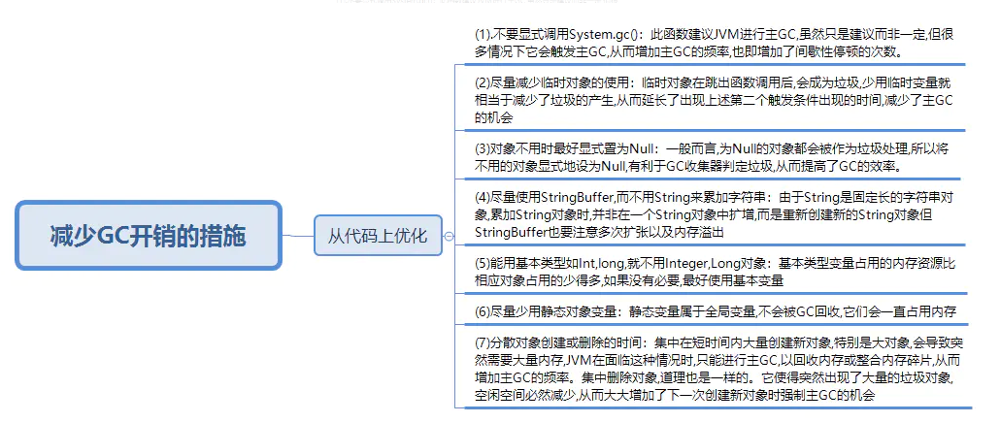

从JVM参数上调优上：

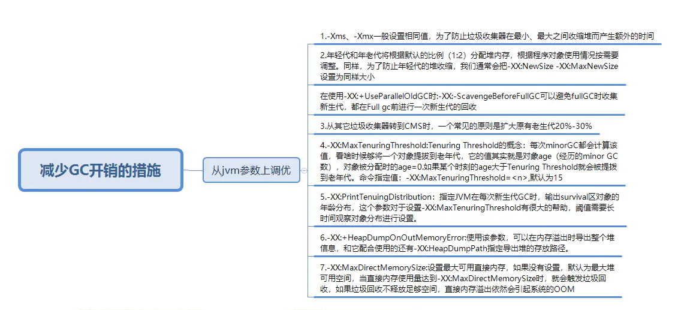

### **3.6 内存溢出分类**

​    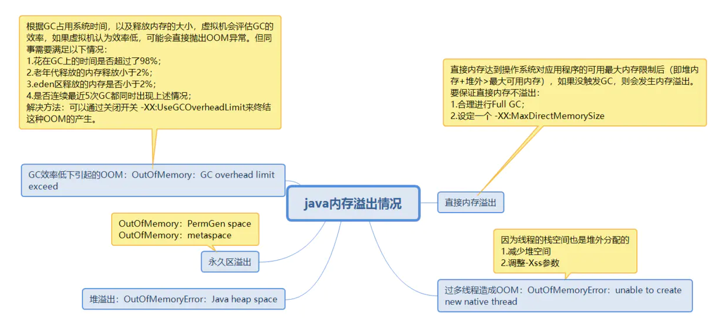

## **四. 总结-JVM调优相关**

### **4.1 调优目的**

​    

### **4.2 JVM性能调优所处的层次**

​    

### **4.3 JVM调优流程**

​    

### **4.4 性能监控工具**

​    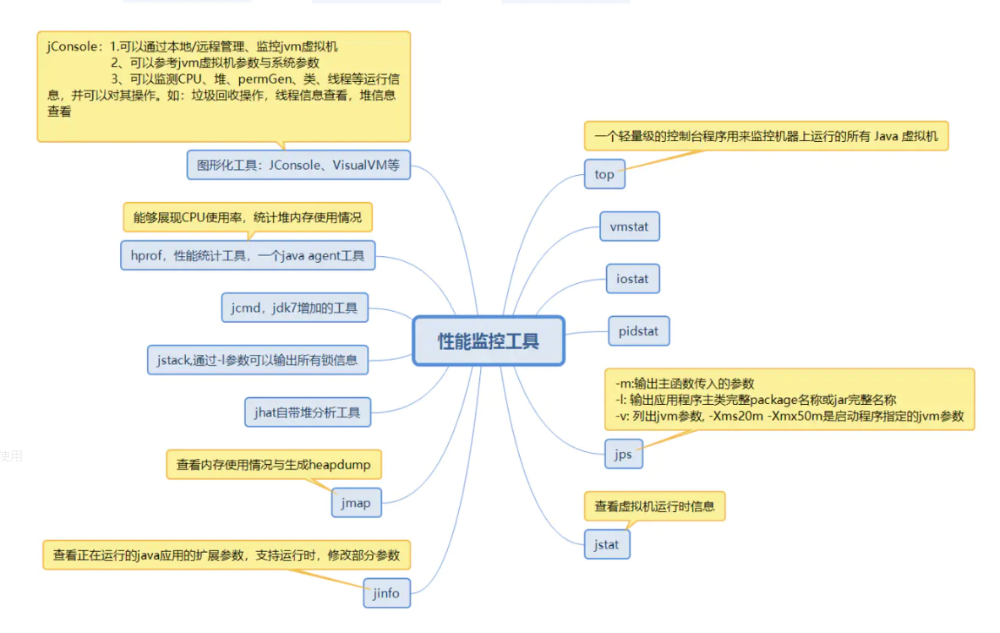

  调优的最终目的都是为了令应用程序使用最小的硬件消耗来承载更大的吞吐。jvm的调优也不例外，jvm调优主要是针对垃圾收集器的收集性能优化，令运行在虚拟机上的应用能够使用更少的内存以及延迟获取更大的吞吐量。