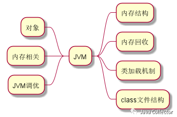
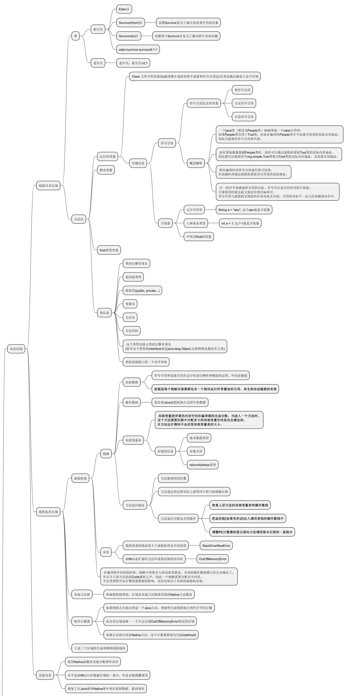
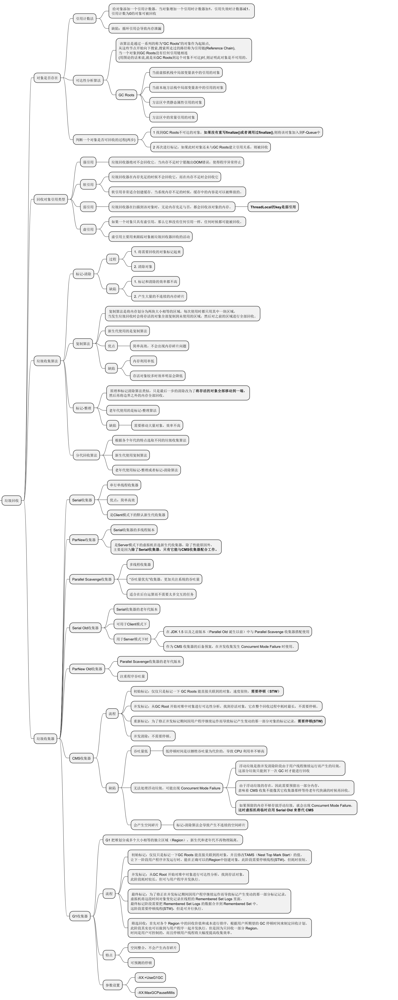
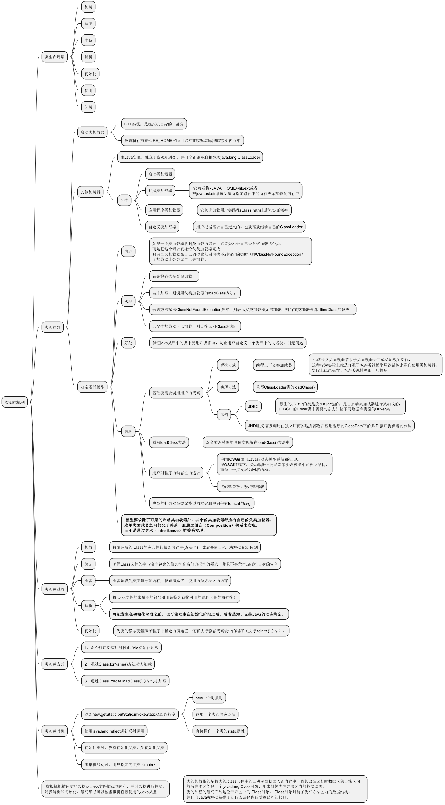
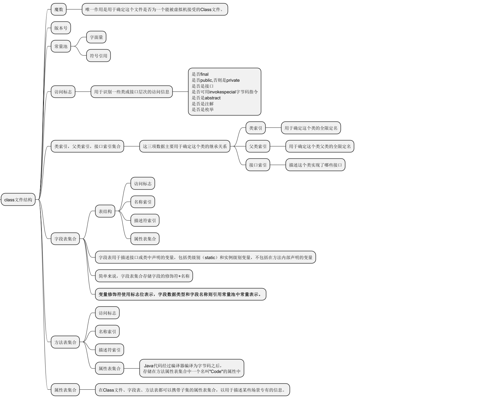
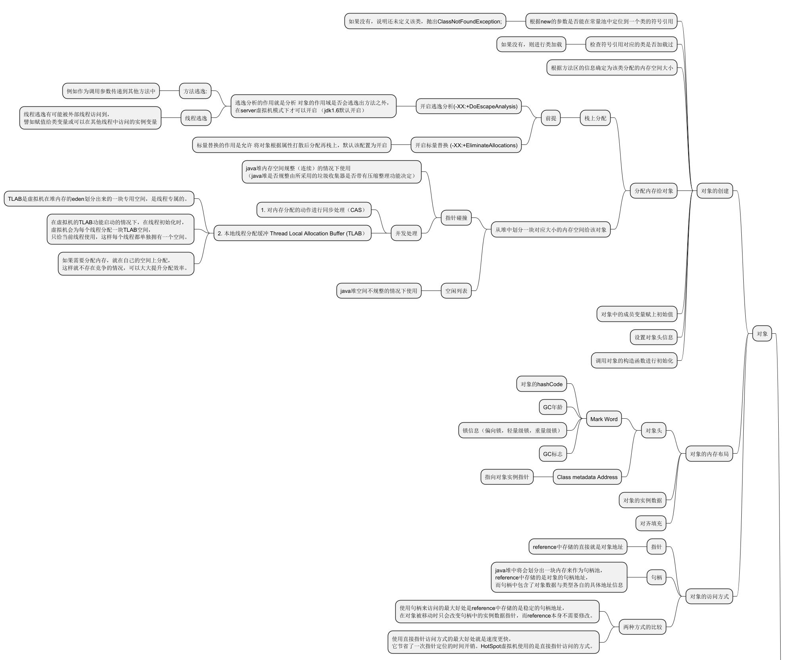
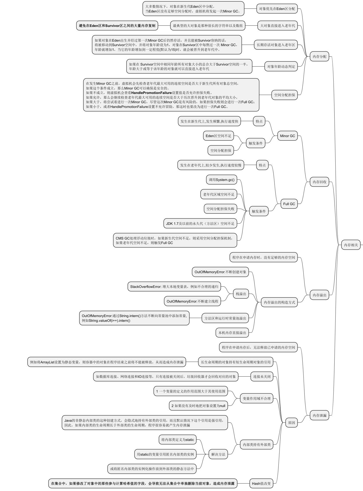
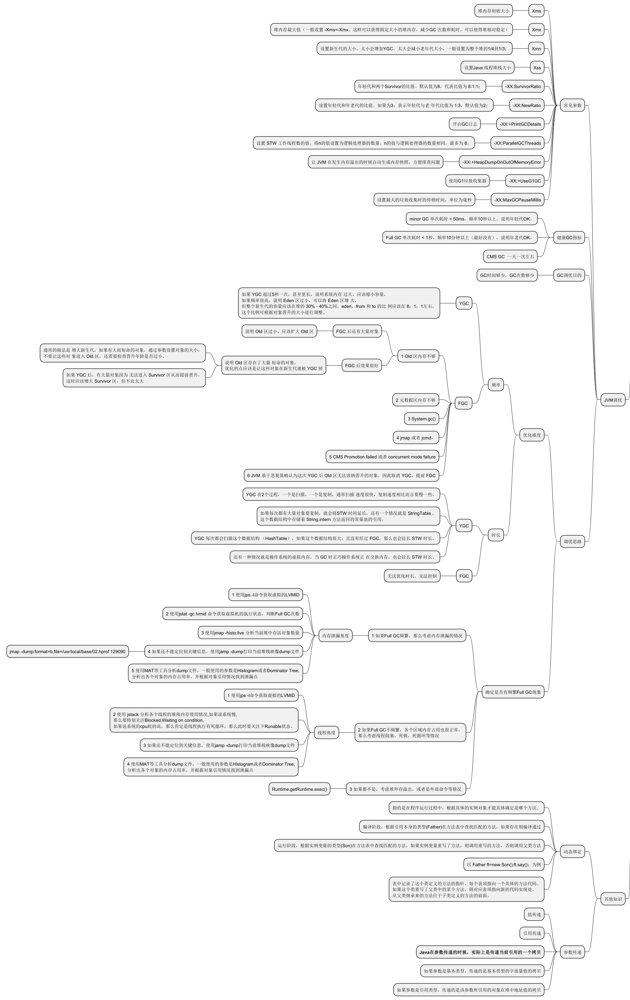

# JVM知识点全方位梳理

很多知识点，平时在开发中涉及比较少，很容易陷入“背了忘，忘了背，背了再忘，忘了再背”的状态。很大程度是因为没系统学习，没有形成深刻印象。

 本文从7个维度梳理JVM相关知识点，分别是：内存结构、内存回收、 类加载机制、 class文件结、 对象、 内存相关、 JVM调优。

## 一、内存结构

 值得特别说明一下的是方法区属于逻辑概念，在《Java虚拟机规范》中定义了方法区的概念与作用。HotSpot在JDK8之前用永久代来实现，之后引入了元空间。

## 二、内存回收

 GC ROOT有哪些？

 CMS存会产生空间碎片，浮动垃圾无法处理。

## 三、类加载机制

 重点需要理解类生命周期每个环节所做的事情。

 容易忽略的是如何破坏双亲委派机制。

## 四、Class文件结构

## 五、对象

 容易忽略点有栈上也可以分配内存给对象，但需要经过逃逸分析

## 六、内存相关

 内存溢出与内存泄漏的定义。

 GC触发条件。

## 七、JVM调优

 重点：GC健康指标。

